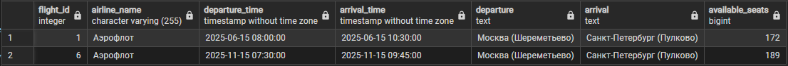

## Представление 1 "FlightDetails"
Информация о рейсах с деталями
```
CREATE VIEW FlightDetails AS
SELECT 
    f.flight_id,
    f.departure_time,
    f.arrival_time,
    f.gate_number,
    dep.airport_name AS departure_airport,
    dep.city AS departure_city,
    dep.country AS departure_country,
    arr.airport_name AS arrival_airport,
    arr.city AS arrival_city,
    arr.country AS arrival_country,
    al.airline_name,
    ap.model AS airplane_model,
    ap.total_seats,
    (SELECT COUNT(*) FROM Tickets t WHERE t.flight_id = f.flight_id) AS sold_tickets,
    ap.total_seats - (SELECT COUNT(*) FROM Tickets t WHERE t.flight_id = f.flight_id) AS available_seats
FROM 
    Flights f
JOIN 
    Airports dep ON f.departure_airport_id = dep.airport_id
JOIN 
    Airports arr ON f.arrival_airport_id = arr.airport_id
JOIN 
    Airplanes ap ON f.airplane_id = ap.airplane_id
JOIN 
    Airlines al ON ap.airline_id = al.airline_id;
```
### Пример
Поиск рейсов между конкретными городами
```
SELECT 
    flight_id,
    airline_name,
    departure_time,
    arrival_time,
    departure_city || ' (' || departure_airport || ')' AS departure,
    arrival_city || ' (' || arrival_airport || ')' AS arrival,
    available_seats
FROM FlightDetails
WHERE departure_city = 'Москва' AND arrival_city = 'Санкт-Петербург'
AND departure_time BETWEEN '2025-01-01' AND '2025-11-30'
ORDER BY departure_time;
```


## Представление 2 "PassengerTickets"
Информация о билетах пассажиров
```
CREATE OR REPLACE VIEW PassengerTickets AS
SELECT 
    p.passenger_id,
    p.last_name,
    p.first_name,
    p.passport_number,
    t.ticket_id,
    t.purchase_date,
    f.flight_id,
    f.departure_time,
    f.arrival_time,
    dep.airport_name AS departure_airport,
    arr.airport_name AS arrival_airport,
    s.seat_number,
    s.class,
    s.position_type,
    s.price,
    s.is_emergency_exit,
    ap.model AS airplane_model,
    al.airline_name
FROM 
    Passengers p
JOIN 
    Tickets t ON p.passenger_id = t.passenger_id
JOIN 
    Flights f ON t.flight_id = f.flight_id
JOIN 
    Seats s ON t.seat_id = s.seat_id
JOIN 
    Airplanes ap ON f.airplane_id = ap.airplane_id
JOIN 
    Airlines al ON ap.airline_id = al.airline_id
JOIN 
    Airports dep ON f.departure_airport_id = dep.airport_id
JOIN 
    Airports arr ON f.arrival_airport_id = arr.airport_id;
```
### Пример 1
Получить все билеты конкретного пассажира
```
SELECT 
    ticket_id,
    departure_time,
    departure_airport,
    arrival_airport,
    seat_number,
    class,
    price
FROM PassengerTickets
WHERE last_name = 'Иванов' AND first_name = 'Иван'
ORDER BY departure_time DESC;
```

### Пример 2
Найти всех пассажиров конкретного рейса
```
SELECT 
    last_name,
    first_name,
    passport_number,
    seat_number,
    class,
    position_type,
    is_emergency_exit
FROM PassengerTickets
WHERE flight_id = 1
ORDER BY seat_number;
```
