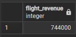

## Процедура 1
Процедура для добавления нового пассажира
```
CREATE PROCEDURE add_passenger(
    p_last_name VARCHAR(100),
    p_first_name VARCHAR(100),
    p_passport_number VARCHAR(15),
    p_date_of_birth DATE,
    p_phone_number VARCHAR(15),
    p_email VARCHAR(255)
)
LANGUAGE plpgsql
AS $$
BEGIN
    IF p_email !~ '^[a-zA-Z0-9._%-]+@[a-zA-Z0-9.-]+\.[a-zA-Z]{2,}$' THEN
        RAISE EXCEPTION 'Некорректный формат email';
    END IF;
    
    IF p_passport_number !~ '^[0-9]{10}$' THEN
        RAISE EXCEPTION 'Номер паспорта должен содержать ровно 10 цифр';
    END IF;
    
    INSERT INTO Passengers (last_name, first_name, passport_number, date_of_bithday, phone_number, email)
    VALUES (p_last_name, p_first_name, p_passport_number, p_date_of_birth, p_phone_number, p_email);
    
    COMMIT;
    RAISE NOTICE 'Пассажир успешно добавлен';
EXCEPTION
    WHEN unique_violation THEN
        RAISE EXCEPTION 'Пассажир с таким email уже существует';
    WHEN OTHERS THEN
        ROLLBACK;
        RAISE EXCEPTION 'Ошибка при добавлении пассажира: %', SQLERRM;
END;
$$;
```
## Пример
```
CALL add_passenger(
    'Иванов', 
    'Петр', 
    '1234567890', 
    '1990-05-15', 
    '+79161234567', 
    'ivanov.petr@example.com'
);
```

## Процедура 2
Процедура для обновления цены места с сохранением истории
```
CREATE PROCEDURE update_seat_price(
    p_seat_id INTEGER,
    p_new_price INTEGER
)
LANGUAGE plpgsql
AS $$
DECLARE
    v_old_price INTEGER;
BEGIN
    SELECT price INTO v_old_price
    FROM Seats
    WHERE seat_id = p_seat_id;
    
    IF NOT FOUND THEN
        RAISE EXCEPTION 'Место с ID % не найдено', p_seat_id;
    END IF;
    
    UPDATE Seats
    SET price = p_new_price
    WHERE seat_id = p_seat_id;
    
    INSERT INTO Price_history (old_price, new_price, seat_id)
    VALUES (v_old_price, p_new_price, p_seat_id);
    
    COMMIT;
    RAISE NOTICE 'Цена места % успешно обновлена с % до %', p_seat_id, v_old_price, p_new_price;
EXCEPTION
    WHEN OTHERS THEN
        ROLLBACK;
        RAISE EXCEPTION 'Ошибка при обновлении цены места: %', SQLERRM;
END;
$$;
```
## Функция 1
Функция для расчета общего дохода по рейсу
```
CREATE FUNCTION calculate_flight_revenue(p_flight_id INTEGER)
RETURNS INTEGER
LANGUAGE plpgsql
AS $$
DECLARE
    total_revenue INTEGER := 0;
BEGIN
    SELECT COALESCE(SUM(s.price), 0)
    INTO total_revenue
    FROM Tickets t
    JOIN Seats s ON t.seat_id = s.seat_id
    WHERE t.flight_id = p_flight_id;
    
    RETURN total_revenue;
EXCEPTION
    WHEN OTHERS THEN
        RAISE NOTICE 'Ошибка при расчете дохода: %', SQLERRM;
        RETURN 0;
END;
$$;
```
## Пример
```
SELECT calculate_flight_revenue(1) AS flight_revenue;
```
